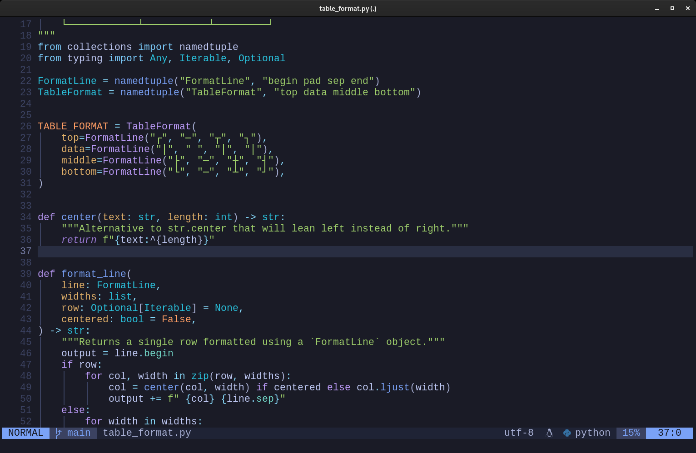

# /docs/neovim.md

My personalized Neovim configuration.

[Go back to README](README.md)

## Requirements:

- Neovim >=0.5.0
- Treesitter

## Whats special about it?

The configuration is using the latest features of Neovim, with plugins fully modernized for the 21st century.

Some highlights of whats being used:
- The modern [packer.nvim](https://github.com/wbthomason/packer.nvim) for Neovim package management.
- [Language Server Proctocol (LSP)](https://en.wikipedia.org/wiki/Language_Server_Protocol) integrations for language features like auto complete, go-to definition, find all references, etc.
- [nvim-treesitter](https://github.com/nvim-treesitter/nvim-treesitter) for syntax highlighting trough Treesitter language parsers.

## Source code

Main configuration file: [init.lua](../configs/nvim/.config/nvim/init.lua)
